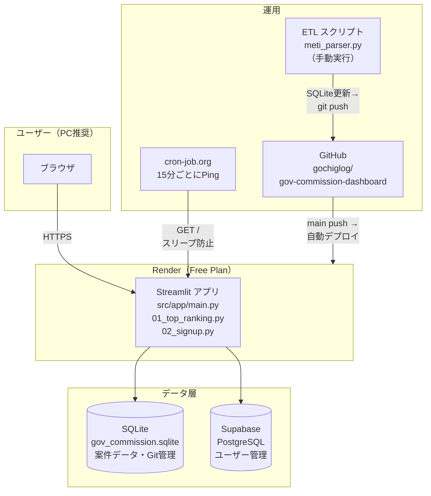

# 官公庁委託調査ダッシュボード

官公庁が民間企業に発注する「委託調査」の受託件数・受託事業者の時系列推移を可視化するWebダッシュボード。
現フェーズは経済産業省データに対応。招待制のID/Password認証でアクセスを管理する。

**本番URL:** https://gov-commission-dashboard.onrender.com

> **推奨環境:** PCブラウザ（Chrome / Safari）。スマートフォンでは表示が崩れる場合があります。

---

## 機能一覧

| 機能 | 説明 |
|---|---|
| 時系列折れ線グラフ | 年度別受託件数の推移を事業者・カテゴリ別に表示 |
| 件数 / シェア(%) 切り替え | 絶対値と省庁全体に占める割合を切り替え表示 |
| カテゴリ別グループ表示 | 事業者をカテゴリ（コンサル・ITベンダー等）に分類して集計 |
| コンサル系サブグループ表示 | コンサル系をさらにグローバル・Big4・国内系等に細分化 |
| 事業者絞り込み検索 | multiselect に直接入力して候補を動的に絞り込み |
| TOP受託事業者ランキング | 期間・省庁別のランキングテーブルと集計メトリクス |
| 招待トークン式ユーザー登録 | 招待URL経由でメールアドレスとパスワードを自分で設定して登録 |

---

## アーキテクチャ



---

## 技術スタック

| 用途 | 技術 |
|---|---|
| Webアプリ | Python 3.10+, Streamlit |
| データ処理 | pandas, openpyxl |
| データベース（案件データ） | SQLite（Gitで管理・読み取り専用） |
| データベース（ユーザー管理） | Supabase（PostgreSQL, 無料プラン） |
| ホスティング | Render（無料プラン） |
| コールドスタート対策 | cron-job.org（15分ごとにPingを送信） |

---

## ディレクトリ構成

```
.
├── .github/
│   ├── instructions/       # Issue / PR / コミットの記述ルール
│   └── commit.instructions.md
├── config/
│   ├── mapping.json        # 事業者名の名寄せ辞書
│   └── groups.json         # カテゴリ・サブグループ定義
├── data/
│   ├── raw/                # 生のExcelファイル（Git管理外）
│   └── processed/
│       └── gov_commission.sqlite   # 整形済みデータ（Git管理）
├── src/
│   ├── data_pipeline/
│   │   ├── parsers/        # 省庁別パーサー（meti_parser.py 等）
│   │   ├── cleaner.py      # 名寄せ・クレンジング処理
│   │   └── user_store.py   # ユーザー登録・認証（Supabase / SQLite）
│   ├── app/
│   │   ├── main.py         # メインダッシュボード
│   │   └── pages/
│   │       ├── 01_top_ranking.py   # TOPランキングページ
│   │       └── 02_signup.py        # 招待登録ページ
│   └── utils/              # 共通ユーティリティ
├── render.yaml             # Render デプロイ設定
├── requirements.txt
└── README.md
```

---

## ローカル開発

```bash
# 依存パッケージのインストール
pip install -r requirements.txt

# アプリ起動
streamlit run src/app/main.py

# 経産省データのETL実行
python src/data_pipeline/parsers/meti_parser.py
```

ローカルでの認証は `config/auth.json`（`auth.json.example` をコピーして作成）を使用する。
Render本番環境では環境変数 `ADMIN_USERNAME` / `ADMIN_PASSWORD` が優先される。

---

## 環境変数（Render）

| 変数名 | 用途 |
|---|---|
| `ADMIN_USERNAME` | 管理者ログインID |
| `ADMIN_PASSWORD` | 管理者ログインパスワード |
| `INVITE_TOKEN` | 招待URL用トークン（`?invite=TOKEN`） |
| `SUPABASE_URL` | Supabase プロジェクトURL |
| `SUPABASE_KEY` | Supabase service_role キー |

---

## 開発ルール

- `main` への直接コミット禁止。必ず `feature/issue-{番号}` ブランチを切ること
- Issue / PR / コミットの書式は `.github/instructions/` 内の各ルールに従う
- 省庁固有のロジックは `src/data_pipeline/parsers/` に閉じ込め、共通スキーマへの変換を担う Adapter パターンを維持する
